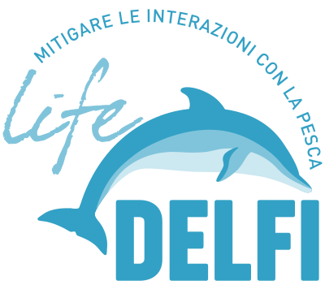
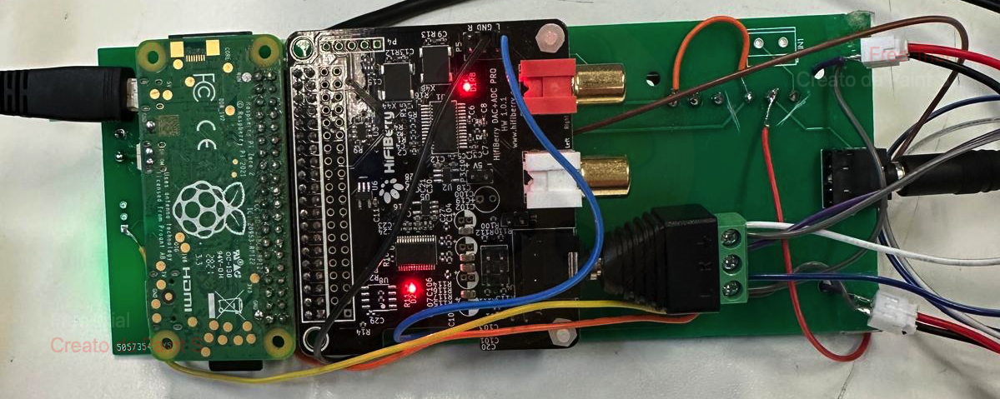
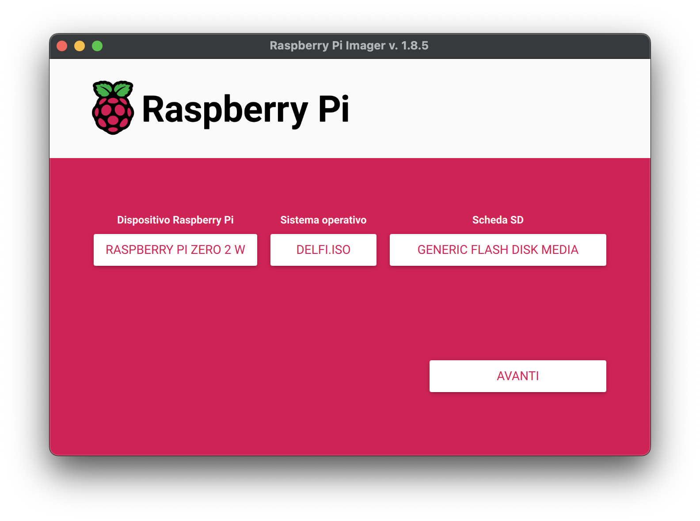
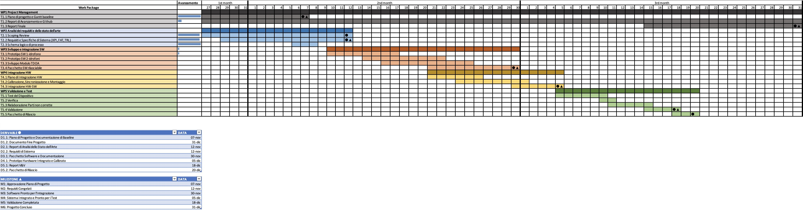

# :dolphin: LIFE DELFI: DEep Life Acoustic Finder

LIFE DELFI è un sistema avanzato di rilevamento, analisi e interazione con sorgenti acustiche subacquee, sviluppato come parte del Corso di Laboratorio di Meccatronica - Università Politecnica delle Marche.

<div align="center">
  
</div>

<div align="center">
  
  
  
  
</div>

## :bookmark_tabs: Indice

1. [:dolphin: Che cos'è LIFE DELFI](#che-cose-life-delfi)
2. [:hammer_and_wrench: Requisiti Hardware](#requisiti-hardware)
3. [:computer: Requisiti Software](#requisiti-software)
4. [:file_folder: Struttura Repository](#struttura-repository)
5. [:gear: Installazione](#installazione)
6. [:test_tube: Test](#test)
7. [:keyboard: Utilizzo da terminale (CLI)](#cli)
8. [:bar_chart: Gantt](#gantt)
9. [:clipboard: TC/TP](#tc)
10. [🎯 KPI](#kpi)
11. [:handshake: Contributors](#contributors)

<h2 id="che-cose-life-delfi">:dolphin: Che cos'è LIFE DELFI</h2>

Il progetto Life DELFI, cofinanziato dal Programma Life dell’Unione Europea, affronta la crescente problematica delle interazioni tra delfini e pesca professionale, con l’obiettivo di ridurre catture accidentali e conflitti tra pescatori e cetacei. In questo ambito, il nostro lavoro ruota attorno alla concezione e realizzazione di DELFi, un sistema innovativo che unisce ricerca scientifica, tecnologie avanzate e sostenibilità economica, promuovendo una convivenza armoniosa tra la conservazione marina e l’industria della pesca.

### :building_construction: Architettura e Funzionamento
DELFI si basa su idrofoni collegati a un Raspberry Pi Zero 2W, i quali consentono di raccogliere ed elaborare in tempo reale i segnali acustici subacquei. Un algoritmo di calcolo del TDOA (Time Difference of Arrival) determina l’orientamento della sorgente sonora. L’hardware è integrato nella “testa” di un pesce martello robotico, costituita da un tubo di plastica concavo di circa 15 x 40 cm.



### :star: Caratteristiche Principali
- **Localizzazione**\
DELFi sfrutta il TDOA per identificare la posizione e la direzione d’arrivo dei suoni prodotti, in particolare quelli emessi dal delfino tursiope.
- **Classificazione Sonora**\
 Un sistema basato su Machine Learning (reti neurali e modelli TensorFlow Lite) riconosce i segnali acustici dei delfini da altre fonti sottomarine.

Grazie a queste funzionalità, DELFi non solo offre un approccio tecnologico avanzato ed economico alla protezione dei delfini (riducendo le catture accidentali e salvaguardando l’attrezzatura da pesca), ma risulta anche perfettamente in linea con gli obiettivi di Life DELFI, contribuendo a modelli di gestione sostenibili che tutelino sia le popolazioni di delfini sia gli interessi dei pescatori.

<h2 id="requisiti-hardware">:hammer_and_wrench: Requisiti Hardware</h2>

Di seguito sono elencati i componenti hardware necessari per la realizzazione del sistema:

- **Raspberry Pi Zero 2W**
  - Processore: ARM quad-core a 64 bit (1 GHz)
  - RAM: 512 MB SDRAM
   - - Connettività: LAN wireless 802.11 b/g/n 2,4 GHz e Bluetooth 4.2 (BLE)
   - - Porte: 1 porta micro-HDMI e 2 micro-USB
   - - GPIO: 40 pin disponibili per l’espansione (alimentazione e segnali di controllo)

- **HiFiBerry DAC+ ADC Pro**
   - Interfaccia: connessione diretta al connettore GPIO del Raspberry Pi
   - Alimentazione: sfrutta direttamente l’alimentazione fornita dal Raspberry Pi
   - Caratteristiche audio:
      - ADC 192 kHz/24 bit su due canali di ingresso
      - Preamplificatore con guadagno di 40 dB integrato


- **Preamplificatore**
   - Stadi di amplificazione:
      1. Amplificatore di tensione a guadagno unitario
      2. Filtro passa alto (Fc = 723 Hz) con guadagno di 10
      3. Stadio con guadagno variabile fino a 10 (mediante potenziometro)
   - Guadagno totale: fino a 100 dB
   - Alimentazione: 3 V con terra virtuale (VCC/2) per supportare l’alimentazione a binario singolo

- **Dischi Piezoelettrici (Idrofoni)**
   - Tipologia: dischi monofacciali da 27 mm
   - Configurazione: due canali stereo, ciascuno composto da due dischi disposti perpendicolarmente all’interno di un contenitore di plastica
   - Guadagno aggiuntivo: circuito preamplificatore SMD dedicato (circa 30 dB)

- **Assembly Board (PCB)**
   - Struttura portante per il posizionamento ottimale di tutti i componenti (Raspberry Pi, HiFiBerry, preamplificatori, ecc.)
   - Connettori:
      - Doppio connettore a 40 pin per collegare il Raspberry Pi all’HiFiBerry
      - 4 porte GPIO e 2 connessioni I2C aggiuntive
     - Pin di alimentazione 5 V e GND dal Raspberry Pi Zero 2W
 
 Questi componenti, opportunamente integrati, costituiscono l’intero sistema di acquisizione e analisi audio basato su Raspberry Pi Zero 2W e HiFiBerry. L’assembly board facilita la connessione e la disposizione fisica di tutte le parti. 

> Nota: Le specifiche complete dei componenti (idrofoni, amplificatori, schemi di collegamento, etc.) sono disponibili nella cartella `docs/` del repository nel documento `documentazione.pdf`.

<h2 id="requisiti-software">:computer: Requisiti Software</h2>

- **Sistema Operativo**
   - [Raspberry Pi OS Lite (32-bit)](https://www.raspberrypi.com/software/operating-systems/#raspberry-pi-os-legacy)
      - Consigliato per l’ambiente embedded su Raspberry Pi, ottimizzato per consumi e risorse ridotte.
- **Librerie Audio**
   - ALSA (Advanced Linux Sound Architecture) come libreria principale per la gestione di ingressi/uscite audio.
   - Jack Audio Connection Kit (opzionale) se si vuole sfruttare un server di connessione audio avanzato.
- **Python**
   - Python 3 (versione ≥ 3.7): consigliato l’utilizzo di ambienti virtuali (venv) per isolare le dipendenze.
   - Librerie:
      - [numpy](https://numpy.org/install/), [scipy](https://scipy.org/install/#installing-with-pip) per l’elaborazione numerica e di segnale.
      - [tensorflow-lite](https://pypi.org/project/tflite/) per l’inferenza dei modelli di Machine Learning.
      - Altre librerie di supporto (es. [pyserial](https://pypi.org/project/pyserial/) per la comunicazione UART).
- **Compilatori e Tool di Build (per Componenti C)**
   - gcc: compilatore C indispensabile per eventuali moduli o estensioni scritti in C.
   - make: gestore di build per progetti con Makefile.
 
> Nota: Per maggiori dettagli relativi all’installazione e all'utilizzo fare riferimento al `manuale_sviluppatore.pdf` disponibile nella cartella `docs/` del repository.

<h2 id="struttura-repository">:open_file_folder: Struttura repository</h2>

```
├── device2/
│   └── wpa_supplicant.conf.txt
├── image/
├── software/
│   ├── Audio/
│   ├── V_TFLite/
│   │   ├── det.sh
│   │   ├── direzione.py
│   │   ├── detector_v3_with_trigger.py
│   │   ├── model.tflite
│   │   ├── power_trigger.py
│   │   ├── run.sh
│   │   ├── start_jack_ring_server.sh
│   │   ├── stop_all.sh
│   │   ├── task1_v3.py
│   │   ├── task2_v3.py
│   │   └── task3_v3.py
│   ├── jack-ring-socket-server/
│   │   ├── Makefile
│   │   ├── jack-ring-socket-server
│   │   ├── argparser.c
│   │   ├── argparser.h
│   │   ├── jackclient.c
│   │   ├── jackclient.h
│   │   ├── main.c
│   │   ├── ringbuffer.c
│   │   ├── ringbuffer.h
│   │   ├── socketserver.c
│   │   └── socketserver.h
│   └── legacy/
└── README.md
```

<h2 id="installazione">:gear: Installazione</h2>

Per avviare il sistema con l’immagine custom, seguire questi passaggi:

1. **:inbox_tray: Download Immagine**\
Scaricare il file `delfi.iso.zip` all’interno del repository.
2. **:floppy_disk: Preparazione SD**\
Utilizzare [Raspberry Pi Imager](https://www.raspberrypi.com/software/) o un software equivalente.

    - Aprire **Raspberry Pi Imager**
    - Selezionare delfi.iso come sistema operativo.
    - Selezionare la SD card come destinazione.
    - Avviare la scrittura.
 
4. **:rocket: Avvio su Raspberry Pi**\
Inserire la SD card nel Raspberry Pi e accendere il dispositivo. Il sistema si avvierà con l’immagine personalizzata.



Questa configurazione garantisce la corretta esecuzione delle funzionalità di registrazione, analisi e trasmissione dell’audio.

<h2 id="test">:test_tube: Test</h2>

Sono disponibili diversi test per verificare il corretto funzionamento del modulo di localizzazione senza richiedere l’installazione del sistema operativo custom.

### :clipboard: Requisiti:

- `python3` installato sul sistema.
- File audio stereo in formato `.wav` come input per la localizzazione.

### :computer: Esempio di utilizzo

1. Posizionarsi nella directory del progetto:
   ```bash
   cd software/V_TFLite
   ```
   
2. Eseguire lo script `direzione.py` passando un file audio in input:
   ```bash
   python3 direzione.py '<percorso_audio>'
   ```
   
   Se non si dispone di un file audio personalizzato, utilizzare quelli presenti nella cartella `Audio/` (es: `0gradi.wav`):
   ```bash
   python3 direzione.py '../Audio/0gradi.wav'
   ```

### :mag_right: Risultati

Il risultato della localizzazione sarà visualizzato nel terminale, ad esempio:
```java
Il suono arriva esattamente dal centro (0-3 gradi)
```

<h2 id="cli">:keyboard: Utilizzo da terminale (CLI)</h2>

- **Avvio AI Detector**
  ```bash
  /home/pi/V_TFLite/run.sh
  ```

- **Stop AI Detector**
  ```bash
  /home/pi/Prova_Delfi/software/V_TFLite/stop_all.sh
  ```
  Se non è eseguibile:
  ```bash
  chmod +x /home/pi/Prova_Delfi/software/V_TFLite/stop_all.sh
  ```

- **TDOA su file**
  ```bash
  cd /home/pi/Prova_Delfi/software/V_TFLite
  python3 direzione.py '/home/pi/Prova_Delfi/software/Audio/0gradi.wav'
  ```

- **Log e output**
  - Log detector: `/home/pi/data/detection_log.txt`
  - Detections WAV: `/home/pi/data/Detections/`

<h2 id="gantt">📊 Gantt</h2>


Il Diagramma di Gantt è stato utilizzato come punto di riferimento per l'intera durata del progetto, consentendo una gestione efficace delle attività e dei tempi di consegna.
  - Data di inizio progetto: 27/10/2025
  - Consegna finale: 20/12/2025 (coincidente con la presentazione della demo).



<h2 id="tc">:clipboard: TC/TP</h2>

Per convalidare il prototipo e il raggiungimento dei KPI definiti, sono state definite le seguenti procedure di test (Test Case). Ogni TC ha un ID univoco, un nome che descrive il test e i componenti principali che vengono messi alla prova.

<div align="center">

| **ID**    | **TC**                          | **Test da effettuare**                                        | **Componenti da testare**    |
|:------|:----------------------------|:----------------------------------------------------------|:-------------------------|
| TC1.1 | Accuratezza e Qualità Campionamento | Verifica della banda di frequenza e qualità del segnale acquisito. | Sistema di acquisizione  |
| TC2.1 | Precisione Angolare         | Verifica dell'errore angolare calcolato dal sistema autonomo. | Codice                   |
| TC2.2 | Accuratezza Rilevamento     | Verifica del rate di successi (TPR) e falsi allarmi (FPR) del modello AI. | Codice                   |
| TC3.1 | Latenza Comunicazione       | Misura del tempo di reazione end-to-end.                  | Sistema Completo         |
| TC3.2 | Distanza di funzionamento   | Misura della distanza di funzionamento massima testabile in assenza di ostacoli. | Sistema Completo         |
| TC4.1 | Stabilità Operativa         | Verifica del funzionamento continuo e ininterrotto.       | Sistema Completo         |
| TC4.2 | Integrità Strutturale       | Test di tenuta stagna del contenitore (IP68).             | Sistema Completo         |

</div>

Di seguito vengono presentate le procedure di test dettagliate per ogni Test Case, inclusi i passaggi da eseguire (TP), i criteri di accettazione e lo spazio per i risultati.

**TC1.1: Test di accuratezza e qualità del campionamento**
- **Test per verificare la banda di frequenza e la qualità del segnale acquisito.**
- **Test Procedures (TP):**
  - TP1.1: Avviare la registrazione “Audio Recording".
  - TP1.2: Riprodurre un segnale di test tra 5 kHz e 25 kHz da sorgente esterna.
  - TP1.3: Arrestare la registrazione e analizzare il file .wav generato tramite analisi spettrale (FFT).
  - TP1.4: Confrontare il segnale acquisito con il segnale originale emesso.
- **Criteri di accettazione:** Il segnale acquisito deve riportare la stessa frequenza del segnale originale.

**TC2.1: Verifica della precisione angolare**
- **Test per misurare l'errore angolare del sistema autonomo.**
- **Test Procedures (TP):**
  - TP1.1: Posizionare la sorgente sonora a 0° rispetto agli idrofoni.
  - TP1.2: Emettere un segnale sonoro.
  - TP1.3: Registrare l'angolo calcolato dal sistema.
  - TP1.4: Ripetere il test per altre angolazioni (es. 45°, 90°, 135°, 180°).
  - TP1.5: Calcolare la differenza media tra l'angolo reale e quello calcolato.
- **Criteri di accettazione:** L'errore angolare medio deve essere minore del 10% rispetto alla vera posizione.

**TC2.2: Verifica dell'accuratezza del rilevamento**
- **Test per verificare l'efficacia del trigger AI.**
- **Test Procedures (TP):**
  - TP1.1: Utilizzare il setup del TC2.1. Preparare una sequenza di 20 segnali (10 fischi e 10 rumori ambientali).
  - TP1.2: Avviare il sistema e riprodurre la sequenza di segnali.
  - TP1.3: Analizzare i log per contare i rilevamenti corretti (True Positives) e i falsi allarmi (False Positives).
- **Criteri di accettazione:** Il sistema deve rilevare correttamente almeno 9 dei 10 fischi (TPR > 85%) e generare non più di 1 falso allarme sui 10 rumori (FPR < 10%).

**TC3.1: Misura della latenza di sistema**
- **Test per verificare la reattività del sistema nel comunicare la presenza e la direzione di un delfino.**
- **Test Procedures (TP):**
  - TP1.1: Inviare un segnale sonoro al dispositivo.
  - TP1.2: Il sistema esegue tutte le operazioni in automatico.
  - TP1.3: Misurare il tempo necessario per completare questa sequenza. Ripetere 10 volte e calcolare la media.
- **Criteri di accettazione:** La latenza media misurata deve essere inferiore a 2 s.

**TC3.2: Misura della distanza di funzionamento massima testabile in assenza di ostacoli**
- **Test per verificare la massima distanza senza ostacoli che permette al sistema completo di funzionare correttamente.**
- **Test Procedures (TP):**
  - TP1.1: Inviare segnali sonoro al dispositivo.
  - TP1.2: Ripetere l'esperimento a diverse distanze.
- **Criteri di accettazione:** Il sistema deve funzionare correttamente con segnali ricevuti da massimo 16 m, poiché è la massima distanza testabile.

**TC4.1: Test di stabilità operativa**
- **Test per verificare la durata del funzionamento autonomo.**
- **Test Procedures (TP):**
  - TP1.1: Con il sistema alimentato da power bank, avviare la modalità autonoma.
  - TP1.2: Lasciare il sistema in funzione per 3 ore consecutive.
  - TP1.3: Al termine delle 3 ore, verificare che il sistema sia ancora operativo e reattivo.
- **Criteri di accettazione:** Il sistema deve mantenere un'operatività stabile per almeno 3 ore, senza malfunzionamenti o interruzioni.

**TC4.2: Test di impermeabilità**
- **Test per verificare l'integrità strutturale del contenitore.**
- **Test Procedures (TP):**
  - TP1.1: Immergere il dispositivo contenente solo gli idrofoni sigillato in acqua a 0.2 metri di profondità per 60 minuti.
  - TP1.2: Immergere il dispositivo contenente solo gli idrofoni sigillato in acqua a 1,5 metro di profondità per 30 minuti.
  - TP1.3: Rimuovere il dispositivo, asciugarlo esternamente e ispezionare l'interno. Verificare se tutti i componenti elettronici all'interno funzionano correttamente eseguendo un test di acquisizione dati.
  - TP1.4: Rieffettuare i punti TP1.1, 1.2, 1.3 con il dispositivo completo.
- **Criteri di accettazione:** Nessuna infiltrazione d'acqua visibile nel contenitore. Il dispositivo deve essere completamente funzionante dopo il test.

<h2 id="kpi">🎯 KPI</h2>

Durante la pianificazione del progetto, sono stati definiti dei KPI (Key Performance Indicator) per garantire il successo del sistema. Tutti i KPI sono stati convalidati, anche se alcuni hanno richiesto più tempo a causa del ritardo nell'arrivo di alcuni materiali.

1.  **Accuratezza e Qualità Campionamento:** Efficacia del sistema nella conversione del segnale analogico in digitale
2.  **Precisione Angolare:** L'errore tra l'angolo di provenienza reale della sorgente e l'angolo calcolato dal sistema autonomo
3.  **Accuratezza Rilevamento:** Il sistema deve identificare correttamente un fischio di delfino quando presente
4.  **Distanza di funzionamento senza ostacoli:** Il sistema deve funzionare in modo corretto nell'intero processo almeno
5.  **Latenza Comunicazione:** Tempo totale tra l'arrivo di un suono e comunicazione del risultato (direzione e timestamp)
6.  **Stabilità Operativa:** Il sistema deve funzionare in modo continuo e autonomo senza interruzioni
7.  **Integrità Strutturale:** Deve essere garantita la protezione IP68, prevenendo infiltrazioni d'acqua

<div align="center">

| **KPI**   | **Descrizione**                       | **Metrica**                 | **Soglia**                      | **Risultato** |
|:------|:----------------------------------|:------------------------|:----------------------------|:----------|
| 1.1   | Accuratezza e Qualità Campionamento | Frequenza di campionamento | 192 kHz                     | ?         |
| 2.1   | Precisione Angolare               | Errore angolare medio   | <10%                        | ?         |
| 2.2   | Accuratezza Rilevamento           | True Positive Rate (TPR) | >85%                        | ?         |
| 3.1   | Latenza Comunicazione             | Tempo end-to-end        | <2 s                        | ?         |
| 3.2   | Distanza di funzionamento senza ostacoli | Distanza in metri testabile massima | <16 m                       | ?         |
| 4.1   | Stabilità Operativa               | Durata funzionamento continuo | >3 h                        | ?         |
| 4.2   | Integrità Strutturale             | Livello di protezione IP | IP68 (nessuna infiltrazione) | ?         |

</div>

<h3>📡 Campionamento del segnale</h3>

KPI 1.1: Accuratezza e qualità del campionamento del segnale acustico
  - 📖 Descrizione: Misura l’efficacia del sistema nella conversione del segnale analogico in digitale, assicurando una rappresentazione precisa e di alta qualità.
  - 🎯 Target: Frequenza di campionamento di 192 kHz.

KPI 1.2: Capacità di riduzione del rumore
  - 📖 Descrizione: Valuta l'efficacia del sistema nel ridurre il rumore ambientale e isolare le frequenze di interesse per garantire una qualità ottimale.
  - 🎯 Target: Isolamento delle frequenze tra 2 kHz - 96 kHz.

<h3>🎯 Precisione nell’ecolocalizzazione</h3>

KPI 2.1: Accuratezza nella determinazione della distanza
  - 📖 Descrizione: Misura la precisione con cui il sistema calcola la distanza delle sorgenti sonore rispetto a quella reale.
  - 🎯 Target: Differenza massima inferiore al 10% della distanza reale.

KPI 2.2: Accuratezza della determinazione dell'angolo
  - 📖 Descrizione: Valuta la precisione nella determinazione dell'angolo di arrivo del suono rispetto alla posizione reale.
  - 🎯 Target: Accuratezza entro il 10% dell'angolo reale.

<h3>💧 Resistenza e stabilità</h3>

KPI 3.1: Resistenza all'acqua del contenitore
  - 📖 Descrizione: Il contenitore del dispositivo deve essere impermeabile, proteggendo i componenti interni da infiltrazioni di liquido.
  - 🎯 Target: Standard di protezione IP68 (impermeabilità alla polvere e all'acqua).

KPI 3.2: Stabilità elettronica e durata della batteria
  - 📖 Descrizione: Il sistema deve operare stabilmente senza malfunzionamenti o interruzioni per un lungo periodo.
  - 🎯 Target: Funzionamento continuo per almeno 6 ore in laboratorio.

<h2 id="contributors">:handshake: Contributors</h2>

| Contributor Name      | GitHub                                  |
|:----------------------|:----------------------------------------|
| ⭐ **Baldelli Gianluca**  | [Click here](https://github.com/Bxster) |
| ⭐ **Guizani Kossay**   | [Click here](https://github.com/KOUSSAY4173) |
| ⭐ **Ricci Ettore**   | [Click here](https://github.com/EttoreRii) |
